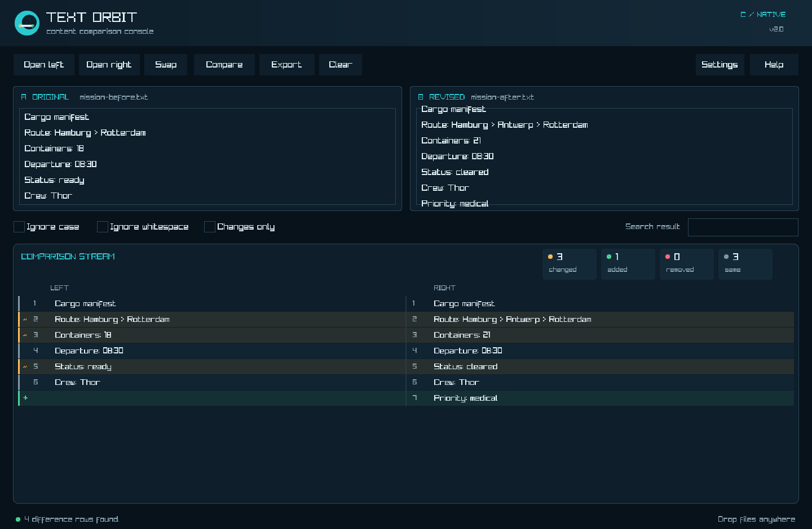
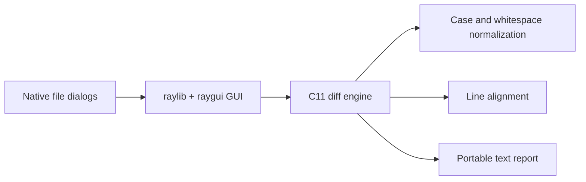

# Text Orbit Compare

[](https://github.com/sofoste93/Text-Content-Comparison-App/actions/workflows/ci.yml)
[](https://github.com/sofoste93/Text-Content-Comparison-App/releases/latest)
[](https://en.cppreference.com/w/c/11)
[](LICENSE)

Text Orbit Compare is a native C desktop application for inspecting two text documents side by side. Version 2 restores the original Python/Tkinter project as a fast, portable and learner-friendly GUI.



## Mission controls

- Open, paste, edit or drag-and-drop two documents
- Line-aligned comparison with changed, added, removed and matching statistics
- Ignore case or normalize whitespace before comparison
- Show only changes and search across the result stream
- Export a readable text report
- Dark and light themes, keyboard shortcuts and built-in help
- Native file dialogs and responsive resizable layout
- C11 comparison engine separated from the graphical interface

## Install

Download the archive for your system from the [latest release](https://github.com/sofoste93/Text-Content-Comparison-App/releases/latest).

| System | Archive | Start |
| --- | --- | --- |
| Windows x64 | `Text-Orbit-Compare-Windows-x64.zip` | `TextOrbitCompare/TextOrbitCompare.exe` |
| Linux x64 | `Text-Orbit-Compare-Linux-x64.tar.gz` | `TextOrbitCompare/run.sh` |

No Python installation is required. Windows may show a SmartScreen notice because community releases are currently unsigned.

On Linux, the application uses the system X11/OpenGL stack. Native open/save dialogs use an available desktop helper such as Zenity or KDialog; the application itself still works if neither is installed, and files can be dragged into the window.

## Quick tour

1. Open a file on each side, paste text, or drop files into the window.
2. Enable **Ignore case** or **Ignore whitespace** when relevant.
3. Select **Compare** or press `Ctrl+Enter`.
4. Filter the stream, search it, then export a report with `Ctrl+S`.

Press `F1` at any time for the built-in flight manual.

## Build with CLion or CMake

Requirements: CMake 3.24+, a C11 compiler, Ninja and Git. CMake fetches the pinned raylib 6.0 source during the first configuration.

```bash
cmake --preset debug
cmake --build --preset debug
ctest --preset debug
```

Open the repository root in CLion to use the included presets. Linux development also requires the X11, OpenGL and ALSA development packages listed in the CI workflow.

## Architecture


```mermaid
flowchart LR
    GUI[raylib + raygui GUI] --> Engine[C11 diff engine]
    Dialogs[Native file dialogs] --> GUI
    Engine --> Normalize[Case and whitespace normalization]
    Engine --> LCS[Line alignment]
    Engine --> Report[Portable text report]
```

The UI owns file selection and presentation. `diff_engine.c` receives two strings and returns owned comparison rows. This boundary keeps the algorithm testable without opening a graphical window.

Read [docs/TUTORIAL.md](docs/TUTORIAL.md) for a guided tour of the C code, memory ownership and line-alignment algorithm.

## Project map

```text
src/                    C application and comparison engine
tests/                  Headless engine tests
assets/                 Logo and Windows icon
packaging/              Platform release metadata
third_party/            Pinned single-file GUI/dialog sources
legacy/python/          Preserved original Python application
docs/legacy/            Original screenshots and notes
```

## Validation

CI builds and tests the project on Windows and Linux. The Linux job also launches the real GUI under a virtual display and captures a frame, catching startup and rendering regressions.

```bash
cmake --build --preset release
ctest --preset release
```

## Limits

Each editor accepts up to 256 KiB. The full line-alignment algorithm is used for ordinary documents; very large line matrices switch to a bounded line-by-line comparison to avoid excessive memory use. Case-insensitive comparison currently covers ASCII characters, while UTF-8 content is preserved in files and reports.

## Legacy and license

The original Python/Tkinter implementation remains in `legacy/python` for learning and historical comparison. The project is released under the [MIT License](LICENSE); dependency notices are in [THIRD_PARTY_NOTICES.md](THIRD_PARTY_NOTICES.md).
