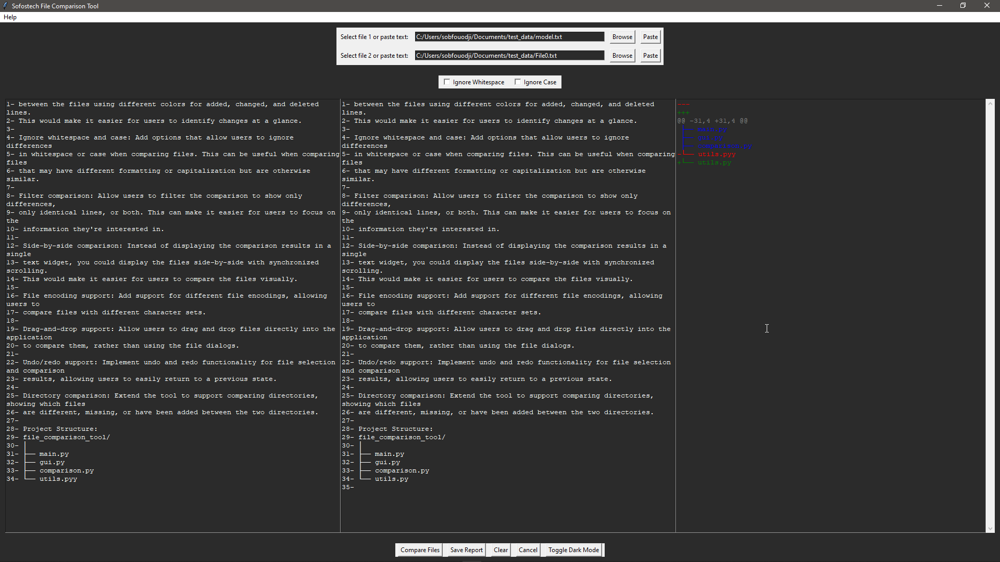

# Text-Content-Comparison-App
 
>This python based App take two text files and compare their content

>

> Images/screenshots
> 
> - This is what you see after launched
> - 
> - Light Mode
> - 
> - dark-mode
> - 
> - if no files is selected/chosen
> - 
> - browse files
> - 
> - hit compare button / check content
> - 
> - Full screen mode for a better experience: check the result
> - 
> - see result apart
> - 
> - you can save report if you need it
> - 
> - ignore whitespace or case
> - 
> - you can use this button to paste text copied elsewhere ;-)or simple Ctrl + v
> - 
> - bottom options
> 
# Contributions
> Stephane Sob F.
