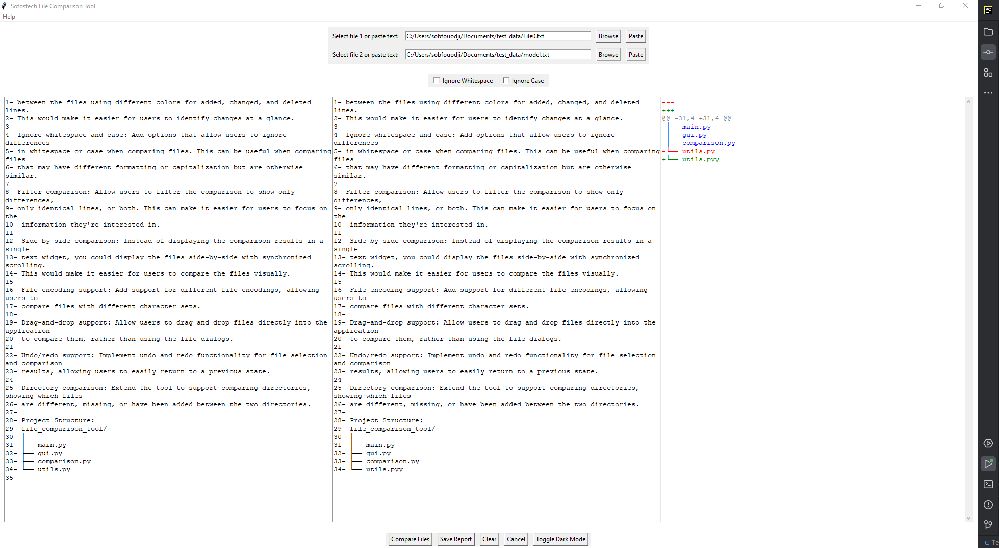

# Text-Content-Comparison-App
>
> ## About Sofostech File Comparison Tool

This is a simple and powerful text and file comparison tool developed with Python and the Tkinter GUI library. It allows you to compare the contents of two files or manually entered text, highlighting the differences line by line, and provides the capability to ignore differences in case or whitespace. It has an easy-to-use graphical interface and supports both file selection and direct text input methods for comparison.

## Features

- Compare two text files or manually entered text.
- Option to ignore case differences or whitespace.
- Visual representation of differences with line numbers.
- 
- Differences are highlighted in green (additions) and red (deletions).
- Display a clear message when no differences are found.
- 
- Save the comparison result as a report.
- Light and dark mode support for the interface.
- Clear functionality to reset all fields for a new comparison.
- Error handling for missing file or text inputs.

## How to Use

1. Open the application.
2. In the fields labeled 'Select file 1 or paste text' and 'Select file 2 or paste text', either browse to select a file or paste/enter the text you want to compare.
3. Choose your comparison options: 'Ignore Whitespace' and 'Ignore Case'.
4. Click 'Compare Files' to see the differences between the two texts. Differences will be highlighted in the 'Results' section.
5. If desired, click 'Save Report' to save the comparison result as a text file.
6. 'Clear' button can be used to reset all fields for a new comparison.

## Screenshots / Gallery

> Images/screenshots
> 
> - This is what you see after launched
> - 
> - Light Mode
> - 
> - dark-mode
> - 
> - if no files is selected/chosen
> - 
> - browse files
> - 
> - hit compare button / check content
> - 
> - Full screen mode for a better experience: check the result
> - 
> - see result apart
> - 
> - you can save report if you need it
> - 
> - ignore whitespace or case
> - 
> - you can use this button to paste text copied elsewhere ;-)or simple Ctrl + v
> - 
> - bottom options
> 

## Contributing

This project is open source and we welcome contributions from the community. If you have ideas on how to improve the tool or want to fix a bug, feel free to fork the repository and submit a pull request. Let's make this tool even more useful together!

Thank you for using the Sofostech File Comparison Tool!

> Stephane Sob F. @sofoste93
